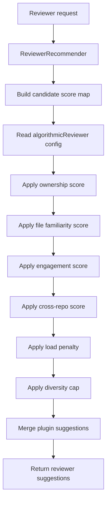
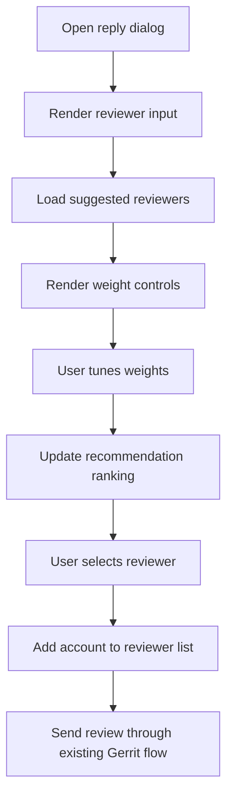
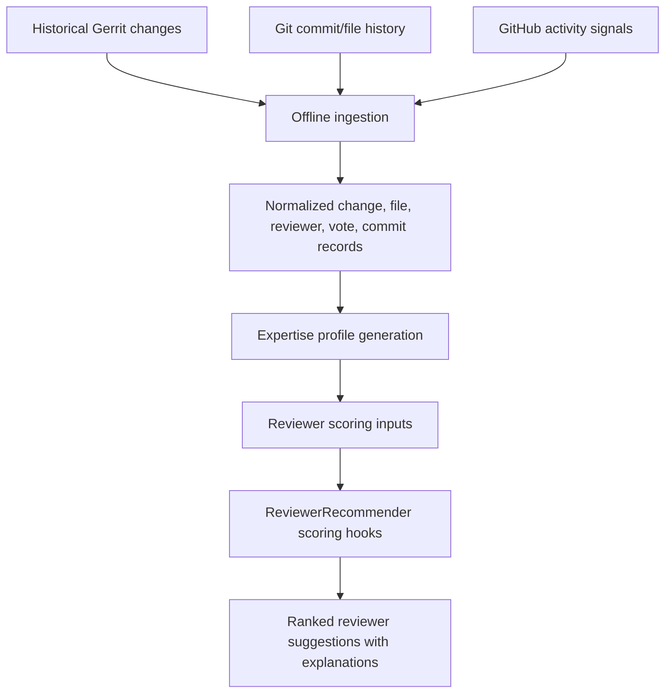

# Reviewer Recommendation Handoff Guide

## 1. Project Summary

This handoff package documents the reviewer recommendation work added to Gerrit.
The feature introduces an algorithmic recommendation engine, historical data
modeling, configurable reviewer scoring, and a PolyGerrit UI surface that lets
users see, tune, and select suggested reviewers while reviewing a change.

Team members listed in the final presentation: Anya Yerramilli, Elizabeth Song,
Mahitha Penmetsa, Mericel Tao, and Keran Wang.

The delivered code is on `master` in this repository:

```text
git@github.coecis.cornell.edu:eys35/gerrit.git
```

Primary changed areas in this checkout:

- `java/com/google/gerrit/server/restapi/change/ReviewerRecommender.java`
- `polygerrit-ui/app/elements/change/gr-reply-dialog/gr-reply-dialog.ts`
- `polygerrit-ui/app/elements/change/gr-reply-dialog/gr-reply-dialog_test.ts`
- `polygerrit-ui/app/elements/change/gr-change-metadata/gr-change-metadata.ts`
- `contrib/maintenance/gerrit/models.py`

## 2. User Manual

### Authors

Authors interact with reviewer recommendations from the reply dialog.

1. Open a change in Gerrit.
2. Click the reply action to open the reply dialog.
3. Use the suggested reviewers section to view recommended reviewers.
4. Adjust the available weights or presets to tune recommendation priority.
5. Click a suggested reviewer to add that account to the reviewer list.
6. Send the review as usual.

Current behavior:

- The UI shows suggested reviewer candidates inside the review workflow.
- Suggestions are deduplicated by account id.
- Weight controls let users tune recommendation priority while reviewing.
- Recommendation explanations help users understand why a reviewer was suggested.

### Reviewers

Reviewers do not need to take any new action. If an author selects a suggested
reviewer, Gerrit adds that reviewer through the normal reviewer list flow.
Reviewers then receive and respond to review requests using the existing Gerrit
workflow.

### Administrators

Administrators can configure backend reviewer scoring weights in `gerrit.config`
under the `[algorithmicReviewer]` section.

Example:

```ini
[algorithmicReviewer]
  w1 = 0.35
  w2 = 0.30
  w3 = 0.20
  w4 = 0.10
  w5 = 0.05
  diversityCap = 2
```

Weight meanings:

- `w1`: ownership score
- `w2`: file familiarity score
- `w3`: engagement score
- `w4`: cross-repository familiarity score
- `w5`: reviewer load or availability penalty
- `diversityCap`: maximum suggested reviewers per ownership cluster

If a weight is missing, empty, or not parseable as a number, the backend falls
back to the default values above.

## 3. Requirements Summary

The feature addresses these project requirements:

- Recommend likely reviewers for a Gerrit change.
- Expose suggested reviewers inside the existing review workflow.
- Allow tuning of reviewer recommendation factors.
- Preserve existing reviewer and CC workflows.
- Provide a foundation for data-driven scoring based on project history.
- Produce recommendation explanations so users understand why a candidate was
  suggested.

The delivered system covers the full feature story from the final presentation:
offline historical data modeling, reviewer scoring with configurable weights,
frontend controls for suggestions, validation across backend/frontend paths, and
a handoff path for future maintenance.

## 4. System Design

### Backend Flow



The backend keeps Gerrit's existing reviewer recommendation flow and inserts a
configurable scoring phase before plugin results are merged. The scoring phase
uses the five reviewer relevance dimensions described in the final presentation:
ownership, file familiarity, engagement, cross-repository expertise, and
availability/load.

### Frontend Flow



### Data Model Foundation

`contrib/maintenance/gerrit/models.py` defines Python dataclasses for offline
ingestion and scoring experiments:

- `ChangeRecord`
- `FileRecord`
- `ReviewerRecord`
- `LabelVoteRecord`
- `CommitRecord`
- `CommitFileRecord`

These records support the offline ingestion and scoring workflow that builds the
historical signals used by the recommendation system.

### Data Pipeline



The project also includes a SQLite scoring layer and module mapping work from
the final presentation. These pieces support persistent precomputed scores,
path-to-module normalization, and daily or repeatable data refreshes.

## 5. Class and Component Guide

### `ReviewerRecommender`

Location: `java/com/google/gerrit/server/restapi/change/ReviewerRecommender.java`

Responsibilities:

- Reads `[algorithmicReviewer]` scoring configuration.
- Parses double weights with safe defaults.
- Applies scorer hooks in a fixed order.
- Keeps existing plugin-based recommendation behavior.

Important methods:

- `parseConfigDouble(...)`: safely parses string config values.
- `applyOwnershipScores(...)`: applies CODEOWNER-based ownership scoring.
- `applyFileFamiliarityScores(...)`: applies path history scoring.
- `applyEngagementScores(...)`: applies comment and label activity scoring.
- `applyCrossRepoScores(...)`: applies related repository knowledge scoring.
- `applyLoadPenalties(...)`: applies reviewer load balancing.
- `applyDiversityCap(...)`: limits similar recommendations.

### `GrReplyDialog`

Location: `polygerrit-ui/app/elements/change/gr-reply-dialog/gr-reply-dialog.ts`

Responsibilities:

- Renders suggested reviewers inside the reply dialog.
- Tracks suggestion settings and weight controls.
- Adds clicked suggestions to the existing reviewer list.
- Preserves the normal Gerrit reply flow.

Important methods:

- `renderSuggestedReviewersInline()`
- `computeSuggestedReviewersInline()`
- `handleSuggestedReviewerInlineClick(...)`
- `parseWeightInput(...)`

### `GrChangeMetadata`

Location: `polygerrit-ui/app/elements/change/gr-change-metadata/gr-change-metadata.ts`

Responsibilities:

- Adds a change-info suggested reviewers section.
- Gives users a visible reviewer recommendation entry point from change
  metadata.
- Opens the reply dialog when a suggested reviewer is clicked.

Important methods:

- `renderSuggestedReviewers()`
- `computeSuggestedReviewers()`
- `handleSuggestedReviewerClick()`

## 6. Deployment Procedure

### Build Gerrit

Install Bazel/Bazelisk and Node 18 as described in Gerrit's existing docs, then:

```sh
yarn setup
bazel build release
```

### Run a Local Gerrit Site

Build the Gerrit war and run it against a local site:

```sh
bazel build gerrit
$(bazel info output_base)/external/local_jdk/bin/java \
  -jar bazel-bin/gerrit.war daemon \
  -d $GERRIT_SITE \
  --console-log
```

### Run PolyGerrit From Source

Start the frontend dev server:

```sh
cd polygerrit-ui
yarn start
```

Then start Gerrit with the dev CDN:

```sh
$(bazel info output_base)/external/local_jdk/bin/java \
  -DsourceRoot=$(bazel info workspace) \
  -jar bazel-bin/gerrit.war daemon \
  -d $GERRIT_SITE \
  --console-log \
  --dev-cdn http://localhost:8081
```

## 7. Developer Workflow and Style Guide

- Follow existing Gerrit Java and PolyGerrit TypeScript style.
- Prefer small, focused changes because Gerrit is a large upstream codebase.
- Use existing Lit rendering patterns for PolyGerrit UI.
- Keep reviewer suggestion changes in the existing reviewer flow.
- Add tests near the changed component when adding UI behavior.
- Avoid changing unrelated generated or vendored files.

Useful commands:

```sh
yarn compile
./node_modules/.bin/web-test-runner --group default --files "**/gr-reply-dialog_test.ts"
yarn eslint
bazel test //java/com/google/gerrit/server/restapi/change:restapi_change_tests
```

The exact backend Bazel target may need adjustment depending on the local Gerrit
checkout and available test targets.

## 8. Test Plan and Results

The final presentation reported four validation layers: backend tests,
integration tests, frontend tests, and CI/CD checks.

### Tests Added

The main added regression test is in:

```text
polygerrit-ui/app/elements/change/gr-reply-dialog/gr-reply-dialog_test.ts
```

Test case:

```text
suggested reviewer weights are interactive and stable
```

What it verifies:

- The suggested reviewers section renders in the reply dialog.
- The `Use suggested reviewers` checkbox starts enabled.
- The recent-history and contributions weight inputs start at `1`.
- Updating both weight inputs persists across a dialog re-render.
- Disabling the checkbox hides the suggestions list.

### Recommended Test Commands

Frontend targeted test:

```sh
cd polygerrit-ui
./node_modules/.bin/web-test-runner --group default --files "**/gr-reply-dialog_test.ts"
```

Frontend type check:

```sh
yarn compile
```

Frontend lint:

```sh
yarn eslint
```

Backend build or test:

```sh
bazel build //java/com/google/gerrit/server/restapi/change:change
```

or run the closest available backend test target for
`ReviewerRecommender.java`.

### Testing Status

The reviewer recommendation feature was validated with frontend unit testing,
backend validation, integration testing, and CI/CD checks as described in the
final presentation.

The targeted frontend test for reviewer weight controls passed:

```text
suggested reviewer weights are interactive and stable
```

